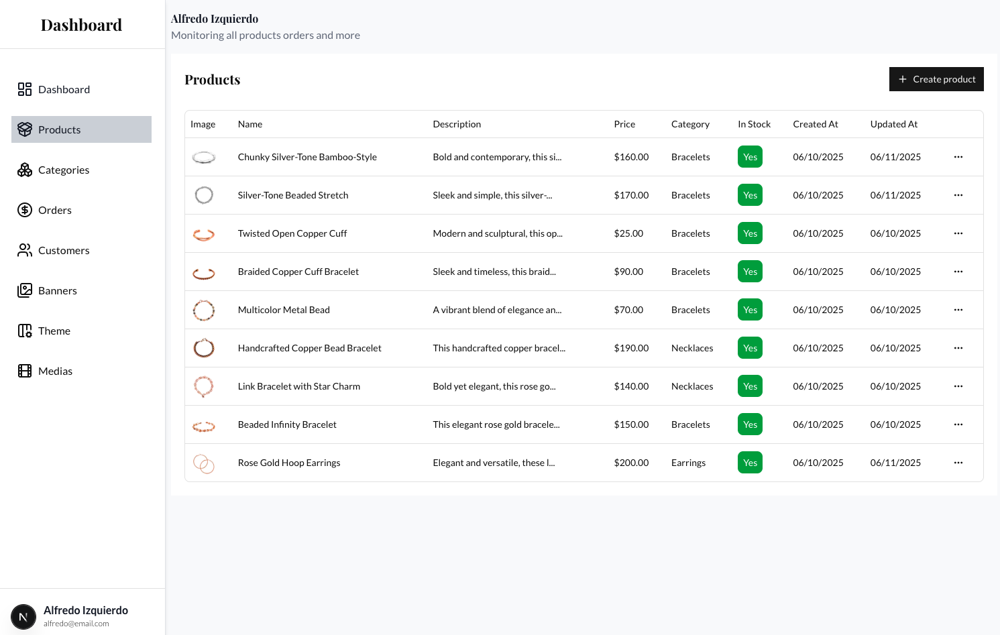
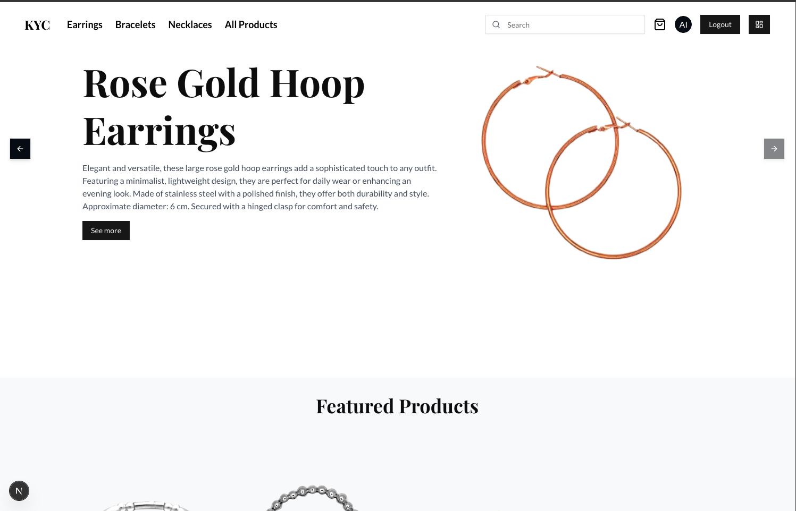

# Mext App E-commerce

Mext App E-commerce is a modern, fast, and secure online shop web application. It allows users to browse products, add them to the cart, and make purchases, while administrators can efficiently manage the catalog and orders.

## Benefits

- **Modern User Experience:** Intuitive and responsive interface, optimized for both mobile and desktop devices.
- **Product and Order Management:** Admin panel to update products, manage inventory, and review orders.
- **Image Upload and Management:** Integration with [Cloudinary](https://cloudinary.com/) to securely and efficiently store and optimize product images.
- **Scalable Database:** Uses [MongoDB](https://www.mongodb.com/) to store product, user, and order information, allowing for scalability and flexibility.
- **Security:** Authentication and authorization to protect user and admin data.
- **Cloud Deployment:** Ready to be deployed on cloud platforms, ensuring high availability.

## Technologies Used

- **Frontend:** React.js (with reusable components and responsive design)
- **Backend:** Node.js + Express.js
- **Database:** MongoDB (NoSQL, flexible and scalable)
- **Image Management:** Cloudinary (image storage and optimization)
- **Authentication:** JWT (JSON Web Tokens)
- **Styling:** CSS Modules / Tailwind CSS (depending on configuration)
- **Deployment:** Vercel, Netlify, or similar

## Main Features

- **Product Catalog:** Browse, search, and filter products.
- **Shopping Cart:** Add, remove, and modify products in the cart.
- **Secure Checkout:** Simple and secure purchase process.
- **Admin Panel:** Create, update, and delete products, manage stock and images.
- **User Management:** Registration, login, and user/admin roles.

## User Roles & Dashboard

Mext App E-commerce features a robust user role system. Regular users can browse products, manage their cart, and make purchases. Administrators have access to a dedicated dashboard where they can manage products, inventory, orders, and users efficiently.

### Dashboard

## Home page

---

With Mext App E-commerce you can launch your online store quickly, securely, and at scale!

## Environment Variables

When deploying to Vercel, set the `AUTH_SECRET` environment variable. This value
is used by NextAuth in both server and edge runtime to sign and verify
authentication tokens.
